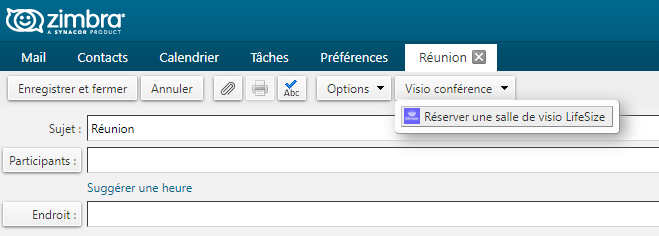
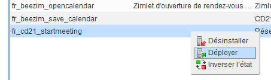

# zimbra-zimlet-lifesize
* Cette Zimlet pour Zimbra 8.8.x permet la réservation de salle virtuelle Lifesize avec intégration des identifiants de connexion directement dans le text du message de la réuinion.
* Elle a été réalisé en ce basant sur le code de Barry de Graaff https://github.com/Zimbra-Community/startmeeting.


## Configuration de la zimlet

* La configuration de la zimlet est réalisée par l'intermédiare du fichier : config_template.xml. Ce fichier définit, entre autre, l'api key lifesize pour la connexion avec le webservice de réservation lifesizecloud.com.
de salle virtuelle

		<global>	
			<!-- Url de connexion vers lifesizecloud.com  -->
			<property name="lifeSizeCreateMeetingURL">https://meetingapi.lifesizecloud.com/meeting/create</property>
			<property name="lifeSizeConnectMeetingURL">https://call.lifesizecloud.com</property>
			<property name="lifeSizeConnectSkypeMeetingURL">https://skype.lifesizecloud.com</property>
	
			<!-- API key pour l'utilisation du webservice lifesizecloud.com -->
			<property name="lifeSizeMeetingAPIKey">123456789</property>
			<property name="lifeSizeConnectAudio">01 01 01 01 01</property>
			
			<!-- Code extension de l'utilisateur lifesize pour lequel la réservation est associée -->	
			<property name="lifeSizeUserExtension">123456</property>
			
			<!-- Nom généric apparaissant dans le libellé de la réservation côté lifesizecloud.com -->
			<property name="lifeSizeMeetingOwner">Zimlet</property>
			
			<!-- Configuration du type de réservation de salle virtuelle --> 
			<property name="lifeSizeTempMeeting">true</property>
			<property name="lifeSizeHiddenMeeting">false</property>
			<property name="lifeSizePrivateMeeting">true</property>
		</global>
		
## Configuration des messages textes
* Tous les messages sont enregistrés dans templates/Startmeeting.template. C'est un fichier xml qui sera compilé par zimbra lors du déploiement pour produire une interface javascript qui servira à l'extraction et l'expansion des messages depuis la zimlet fr_cd21_startmeeting.js. 
* Chaque template est identifié par un *id* unique contenant du texte (html ou text/plain), des variables identifiés par la syntaxe *<$=data.param$>* qui seront remplacées automatiquement lors des appels à la fonction zimbra :

```javascript
AjxTemplate.expand("fr_cd21_startmeeting.templates.Startmeeting#about",
						{name:"Zimlet",description:"MaZimlet",version:"1.0.0"});
```
	
	<template id="about">
		'/>
		<div>
			<p>Zimlet : <$=data.name$></p>
			<p>Description : <$=data.description$></p>
			<p>version : <$=data.version$></p>
		</div>
	</template>

## Convention de nommage
* Cette zimlet à été développé pour le Conseil Département de la Côte d'Or. Le nommage des fichiers et des objets sont préfixés avec *cd21*. Il est conseillé de l'adapter en changeant tout ou partie du nom en fonction du context d'utilisatiion.
	
# Intégration Eclipse
* Le projet est modifiable depuis Eclipse (version 2020-12 - Eclipse IDE for Enterprise Java Developers) pour bénéficier d'un environnement de développement adapté.
	
## Création de l'archive
* Le déploiement pour zimbra necéssite de construire une archive (zip) qui sera téléchargée sur le serveur via l'interface d'administration.



* Le fichier *package.xml* décrit la structure et les fichiers à incorporrer dans l'archive. Il est exécutable depuis Eclipse en utilisant *Ant* pour produire un zip. Il faudra adapter ce scripte au context pour la génération du fichier final.

	<zip destfile="${workspace.dir}/_ZimbraIntegration_/dist/fr_cd21_startmeeting.zip"
	 	basedir="${workspace.dir}/${project.name}"
	 	includes="**/*.*"
	 	excludes=".project, .settings/**,old/** package.xml">
	</zip>

## Configuration Zimbra
* L'installation de la zimlet nécessite de configurer zimbra pour autoriser les clients à appeler le webervice *lifesizecloud.com* par l'intermédiaire du proxy zimbra.
* Cette configuration est réalisée directement depuis le serveur Zimbra en ligne de commande.
* **Remarque :** L'autorisation d'utilisation du domaine pour un compte ne semble pas fonctionner avec notre version de Zimbra. L'autorisation est définie au niveau de la *COS*.

```bash
  su - zimbra
  zmprov mc cos-cotedor-dsi +zimbraProxyAllowedDomains *.lifesizecloud.com
  # pour une personne (mais ne fonctionne pas)
  # zmprov ma nicolas.Lavoillotte@cotedor.fr +zimbraProxyAllowedDomains *.lifesizecloud.com(ne fonctionne pas!)
   
  # vérification :
  zmprov gc cos-cotedor-dsi | grep zimbraProxyAllowedDomains
  zimbraProxyAllowedDomains: *.lifesizecloud.com
  ```
  
* ou depuis l'interface d'administration


* Rechargement du mailstore pour prendre en compte les changements

```bash
  su - zimbra
  zmmailboxdctl restart
  ```

## Déploiement et mise à jour
* Le déploiement sera réalisé directement depuis l'interface d'administration. Avec l'option déployer dans la configuration du serveur Zimbra, section Zimlet.


* **Remarque :** Si des modifications sont apportées dans  le fichier *config_template.xml* après déploiement, et pour qu'elles soient prisent en compte, c'est le seul moyen que j'ai trouvé, c'est de supprimer puis de réinstaller la zimlet. Cette remarque est valable aussi pour les servlets (jsp), qui sont compilées par jetty une seule fois au déploiement.


